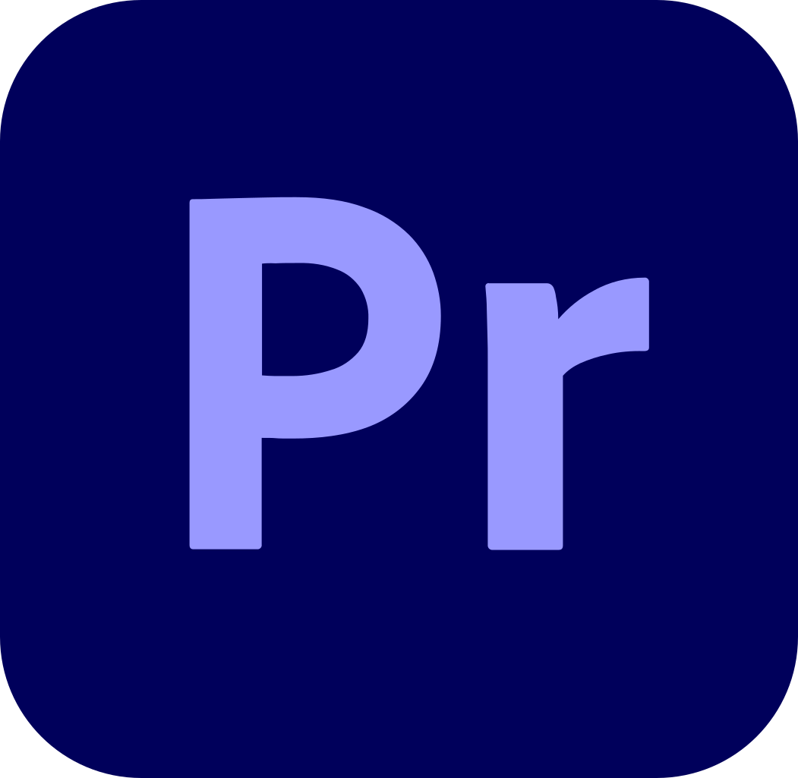
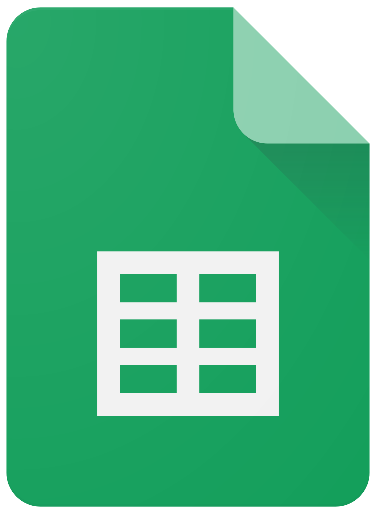

- 👋 Hi, I’m @andyn-network, a future web developer, designer, software engineer. 
- 👀 I’m interested in ... web development, programming, design, film, photography, music and gaming.
- 🌱 I’m currently learning ... javascript.
- 📫 How to reach me ... [twitter](https://twitter.com/andyn_network "twitter"), [reddit](https://www.reddit.com/user/andyn-network "reddit") and [discord](https://www.discordapp.com/users/1131188074173444167).

## Languages I Know:
       

<!---
andyn-network/andyn-network is a ✨ special ✨ repository because its `README.md` (this file) appears on your GitHub profile.
You can click the Preview link to take a look at your changes.
--->
